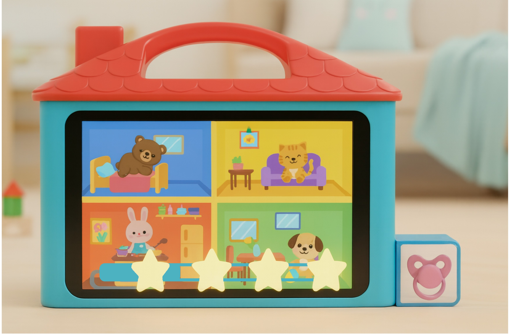

# Afbouwen tutgebruik
Een slimme tool die kinderen en ouders helpt bij het afbouwen van het tutgebruik.

🛠️ Built by Arne Oosterbosch & Loes Vanmeerbeek
  
🔥 Supervised by ``prof. dr. Bas Baccarne``, ``Yannick Christiaens`` & ``Wouter Devriese``    
🌱 Grown at ``Ghent University`` 🏛️ ``Industrial Design Engineering`` ([project overview](https://github.com/basbaccarne/human-centered-design))       

*19/01/2026*   

## Samenvatting
<!-- Max 200 woorden. Beschrijf je project in het kort, waarbij je deze vragen zeker beantwoordt: -->

Veel kinderen hechten een sterke emotionele waarde aan hun tut, het is een belangrijk troostmiddel. Het stoppen van het tutgebruik verloopt daarom vaak moeilijk, zowel voor het kind als voor de ouders. De huidige methodes, zoals het meegeven van de tut aan Sinterklaas, de tuttenboom of de tuttenfee, zorgen voor een vrij abrupte en emotionele overgang. Dit leidt tot een, hoewel kortstondige, stressvolle periode voor ouder en kind.

Dit probleem werd onderzocht aan de hand van interviews met ouders (N=4), aangevuld met literatuuronderzoek en benchmarkonderzoek in de discovery-fase. In de definition-fase werden drie onderzoekwaves uitgevoerd, waaruit belangrijke implicaties naar voren kwamen.

Het concept dat hieruit finaal voortvloeide is een interactief huis waarin kinderen hun tut kunnen “parkeren”. De tut wordt voor een instelbare tijd, bepaald door de ouders, vastgezet. Hiervoor wordt een voorgestelde tijsspanne voorzien door de tool. Tijdens deze periode ziet het kind visuele feedback zoals sterretjes op een voortgangsbalk, deze balk geeft weer hoeveel hoever het kind in het proces zit en geeft een indicatie aan het kind wanneer deze de tut terug mag. 
De kinderen hebben zelf de keuze om na de ingestelde tijd de tut langer af te staan en zo een grotere beloning te verkrijgen, deze corresponderen met verdergelegen sterretjes op de voortgangsbalk.
Wanneer het kind de tut terugneemt heeft deze een keuze tussen 3 varianten van een beloning. 
De tijd zonder de tut zal gradueel opbouwen en het zal langer duren om sterretjes te verdienen.

Deze oplossing vermindert de afhankelijkheid van de tut stapsgewijs, het kind heeft motivatie door de naderende beloning en de visuele groei zichtbaar van de tool. 

<!-- - Wat is het probleem?
- Hoe heb je dit onderzocht?
- Wat is jouw oplossing?
- Hoe lost jouw oplossing het probleem op?
- Hero sketch/render/image, vb. -->

  

## Introductie
<!-- Max 300 woorden. -->

De emotionele waarde van een fopspeen is groot. Baby’s zijn vaak sterk gehecht aan hun fopspeen. Zuigen brengt niet alleen voeding, maar ook rust en troost. (Gezinsbond, z.d.)[^1]. ‘Voor veel kinderen is het immers hun troost, hun slaapvriend en soms zelfs hun beste maatje.’ (De opvoedcoach, z.d.)[^2]. 
Maar de Consumentenbond (z.d.)[^3] stelt dat een fopspeen de groei van het gehemelte kan beïnvloeden doordat de tong naar beneden wordt gedrukt in plaats van het gehemelte te raken. Daarnaast blijkt dat langdurig gebruik de kans op middenoorontstekingen verhoogt. 
Het is dus belangrijk dat de tut op jonge leeftijd uit het leven van het kind verdwijnt. Momenteel word de tut meegegeven aan Sinterklaas, de tuttenboom of tuttenfee en verdwijnt de tut ogenblikkelijk. Ouders en kind maken hierdoor en korstondige, zeer emotionele periode door.
‘Woede, verdriet, angst: bij het afscheid van het tutje maakt je kindje al deze fases door.’ (De roze doos, z.d.)[^4] Ouders zijn hierdoor ook terughoudend om het gebruik snel af te leren. 
Het doel van deze tool is om het tutgebruik voor het finale afscheid gradueel af te bouwen om zo de overgang emotioneel te verzachten. Hierbij moeten ouders ondersteund worden in het afbouwproces en moeten zij hier controle over behouden. Verder moet het kind een gevoel van emotionele veiligheid behouden en moet het zelf met een positieve instelling en motivatie in het proces staan.

<!-- Kader je project. Introduceer het probleem en jouw doelstellingen (inclusief boundary conditions).
Maak gebruik van bronverwijzingen ([zie APA stijl](https://www.scribbr.nl/category/apa-stijl/)). Zoals bijvoorbeeld (Thomas & Ritter, 2022) [^1] . -->

## Inhoudstafel

1. [Methodologie](./docs/methodologie.md)
2. [Discovery](./docs/discovery.md)
3. [Defintion](./docs/definition.md)
4. [Design Requirements](./docs/design_requirements.md)
5. [Bill of materials](./docs/bom.md)

## Kritische reflectie
<!-- Max. 500 woorden -->
Dit ontwerpproces bevatte zowel sterke punten als aspecten die voor verbetering vatbaar waren.

In de definition-fase werd een goed begrip van de probleemruimte verkregen door middel van literatuur- en benchmarkonderzoek specifiek voor de probleemruimte. Daarnaast werd in elk interview expliciet gepolst naar ervaringen met tutgebruik en de bijbehorende struikelpunten.

Een belangrijke uitdaging in beide onderzoeksfases was het vinden van respondenten die voldeden aan de doelgroep (ouders met kinderen tussen 2 en 5 jaar). Ook het organiseren van thuisinterviews bleek moeilijk door het afstandsverschil tussen school en thuis. Aangezien de respondenten zich voornamelijk in onze thuisregio’s bevonden was het lastig om geschikte interviewmomenten te vinden, zeker in het weekend wanneer zij tijd met hun kinderen wilden doorbrengen.

Het opnemen van de interviews bleek een grote meerwaarde. Door deze opnames te herbeluisteren en te transcriberen konden alle relevante inzichten zorgvuldig worden vastgelegd, wat de kwaliteit en betrouwbaarheid van de analyse verhoogde.

Achteraf gezien hadden pedagogen eerder in het proces betrokken kunnen worden. Hun inzichten waren zeer waardevol en bevestigden grotendeels de resultaten uit WAVE 1 en WAVE 2. Indien zij vroeger geraadpleegd waren, had dit mogelijk sneller geleid tot het eindconcept en had eerder gestart kunnen worden met gebruikerstesten.

Deze gebruikerstesten konden nog niet uitgevoerd worden omdat de focus tot nu toe voornamelijk lag op de conceptualisatie van de tool. Hoewel het beloningssysteem werd gevalideerd via interviews, moet dit nog getest worden in realistische gebruikssituaties om te observeren of de motivatie en aandacht van kinderen behouden blijft. Ook de opbouw en ergonomie van de interface vereisen verdere testing. Hierop moet gefocused worden naar de volgende fases toe.

Tot slot verliep het groepswerk in de eerste WAVE moeizaam door een gebrek aan communicatie en taakverdeling. Na het opstellen van duidelijke afspraken en verantwoordelijkheden verbeterde de samenwerking.

## Noot inzake het gebruik van AI
<!-- Licht toe op welke manier je AI gebruikte in dit project. -->
Ai, specifiek ChatGPT, werd gebruikt als inspiratiebron voor ideegeneratie van concepten. Verder werd Figma Make gebruikt om een interfase van een concept te prototypen in WAVE 2. Finaal werd Vizcom gebruikt om de 5 concepten van WAVE 1 en het eindconcept te visualiseren aan de hand van eerder gemaakte schetsen en prompts. 
Verder werd er gebruikgemaakt van speak to tekst AI om de opnamens van de intervieuws te transcriberen. Dit gebeurde met TurboScribe en met de built-in functie in MS Teams.

## Bijlagen
### Discovery
* Literatuuronderzoek (iteratie 1 N=12; iteratie 2 N=10)
  * [Protocol](https://drive.google.com/file/d/15U9IWZ--omdJ6xzIkhTUAmE-31aCuCi5/view?usp=drive_link)
  * [Rapport](https://drive.google.com/file/d/1YNpuBwwfPAsfsY4IAO3G3PJZb65Y0v1m/view?usp=drive_link)
* Benchmarkonderzoek (N=14)
  * [Protocol](https://drive.google.com/file/d/1XnSyVBmMh3gjSOEp_HzEzGY6mTpbD50O/view?usp=drive_link)
  * [Rapport](https://drive.google.com/file/d/119J4bg0LSY7QWqJH_zCYeypWofi05ohk/view?usp=drive_link)
* Interviews (N=3)
  * [Protocol](https://drive.google.com/file/d/1ADO25fnMRPdoYmWG6HtR9QI1mex7xOla/view?usp=drive_link)
  * [Rapport](https://drive.google.com/file/d/1cDNH9Jo70q3FyCBBtWTjgxl0r6BWUpSW/view?usp=drive_link)

    
### Definition
* User testing wave 1 (N=4)
  * [interview protocol kinderbegeleiders](<Interview protocol_wave1_kinderbegeleiders.pdf>)
  * [interview protocol ouders](<Interview - protocol - ouders -wave1.pdf>)
  * [interview rapport WAVE 1](<Interview_rapport_Wave 1.pdf>)
* User testing wave 2 (N=3)
  * [Inerview protocol WAVE 2](<Interview - protocol - ouders -wave2.pdf>)
  * [interview rapport WAVE 2](<Interview_rapport_Wave 2.pdf>)
* Expert interview wave 3 (N=2)
  * [Interview protocol WAVE 3](<Interview - protocol - experts_wave3.pdf>)
  * [Interview rapport WAVE 3](<Interview_rapport_Wave 3_expert interviews (1).pdf>)

## Licentie
<!-- > :warning: voeg jullie namen toe in de documenten hieronder en delete dan dit lijntje    -->

This repository contains both software and design materials created as part of an industrial design energineering project at Ghent University.

- **Software and code:** [MIT License](./LICENSE-MIT)  
- **Design, documentation, CAD, and media:** [CC BY 4.0 License](./LICENSE)
  
You are free to reuse and build upon this work, both commercially and non-commercially, as long as proper attribution is given to the original authors.

## Bronnen
 [^1]: Gezinsbond. (z.d.). Stoppen met het tutje: Tips voor een makkelijker afscheid. Geraadpleegd op [22 oktober 2025], van https://www.gezinsbond.be/inspiratie-advies/stoppen-met-het-tutje-tips-voor-een-makkelijker-afscheid
 [^2]: De Opvoedcoach. (z.d.). Afscheid van het tutje – De Opvoedcoach. Geraadpleegd op [22 oktober 2025], van Afscheid van het tutje – De Opvoedcoach
 [^3]: Consumentenbond. (z.d.). Fopspeen, speen of tut: advies over het gebruik. Geraadpleegd op [22 oktober 2025], van https://www.consumentenbond.nl/veilig-slapen/fopspeen
 [^4]: De Roze Doos. (2023, 8 september). Hoe je kind laten stoppen met het tutje? Geraadpleegd op [22 oktober 2025], van https://www.derozedoos.be/nl/baby/groei-van-de-baby/ontwikkeling-van-het-kind/hoe-je-kind-laten-stoppen-met-het-tutje

