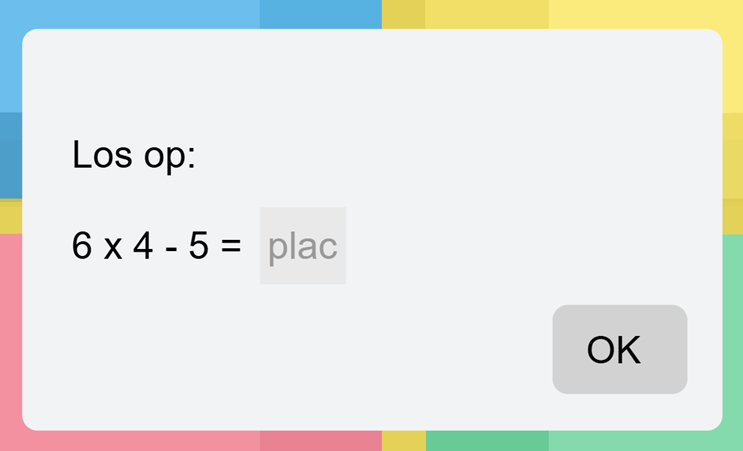

# Finaal prototype

  
  <em>Heroshot</em>  

Na discovery, development en definition doorlopen te hebben wordt er geland op dit finale concept. Het is een interactief huis dat kinderen ondersteunt bij het geleidelijk afbouwen van hun tutgebruik. Via een interactief verhaal, beloningen en oplopende wachttijden worden kinderen gemotiveerd om steeds langere periodes zonder tut door te brengen.

## Gebruik
Dit is een interactief huis dat de ouders via een uileendienst tot hun beschikking hebben. De tool komt in een doos die de instructies voor het gebruik van de tool bevat, de tool zelf (inclusief boek en auto) en een knuffelbeer die bij het finaal afscheid aan het kind gegeven zal worden.

De tool bevat een boek dat in verhaalvorm het gebruik van de tool zal uitleggen. Het verhaal gaat over een beer die gaat verhuizen, maar zijn huis moet eerst ingericht worden. Hiervoor roept hij de hulp van een timmerman in, de timmerman kan echter alleen werken wanneer hij de tut van het kind krijgt. 

Om de tut aan de timmerman te geven moeten de kinderen hun tut in de auto leggen en de garage sluiten. 

Dan dienen de kinderen te wachten tot de tijdsbalk de tweede ster bereikt. Vanaf dat moment is de timmerman klaar met werken en is één meubel klaar. Het kind heeft dan de keuze:
1. De tut uit de garage halen en een beloning krijgen. 
2. Wachten tot een later sterretje en een grotere beloning krijgen. Deze zal hetzelfde zijn als de beloning (in 1.) maar met een extra auditieve beloning.

De eerste ster vormt een eerste mijlpaal. Wanneer het kind de tut tussen de eerste en tweede ster terugneemt, ontvangt het enkel een auditieve aanmoediging en geen beloning. Wanneer het kind voor de eerste ster de tut terugneemt zal deze geen feedback ontvangen.

Vanaf het moment dat het kind de tut uit de garage haalt, krijgt deze de keuze tussen 3 beloningen, deze beloningen stellen het meubel voor dat de beer heeft gemaakt. De kinderen hebben keuze tussen 3 kleurvariaties om de cognitieve belasting van het kind zo laag mogelijk te houden.

   
  <em> Beloningen </em>

## Interactief boek
De tool zal telkens aangeven wanneer het volgende hoofdstuk van het boek gelezen mag worden. Zo blijft het kind betrokken in het leven van beer en blijft het interesseniveau van het kind hoog. 

Wat in het boek gebeurt is verbonden met de beloningen die het kind zal ontvangen in de tool. 
Het kind kan keuzes maken in het boek en via pictogrammen deze keuzes naar de tool communiceren. Zo krijgt een kind een gepersonaliseerd verhaal en bevordert dit de interesse nogmaals.

Er werd gekozen om met een boek te werken, en niet via animaties op het scherm, om de schermtijd tot een minimum te beperken.

## Tijdsverdeling
Initieel stelt de ouder de tijdsperiodes in die het kind zal volgen door volgende interface bij aanvang in te vullen:

   
  <em> Initiële setup </em>

Op basis van de door de ouder ingestelde parameters berekent de tool automatisch tussenliggende tijdsperiodes. Het algoritme bepaalt zowel de grootte van de stappen als het aantal succesvolle herhalingen dat nodig is voordat het kind naar een langere periode zonder tut kan doorgroeien. Op deze manier stippelen de kinderen hun eigen traject uit naast hetgene dat door de tool wordt vooropgesteld.

Verder zal de ouder, wanneer deze bijvoorbeeld wenst dat het kind een volledige nacht zijn tut afstaat, een éénmalige tijdsperiode instellen. Ook kan deze aan de tool aangeven dat het proces sneller of trager mag gaan. Dit kan ingesteld worden in volgende interface:

   
  <em> Instellingen ouders </em>

Deze interface is beschermd door een rekensom, zo kunnen enkel ouders aan deze instelling.

   
  <em> Rekensom </em>

## Meldingen

De ouders kunnen beslissen om een melding op de tool te ontvangen ter herinnering dat deze gebruikt dient te worden. Dit kan ingesteld op een vast moment op de dag, zodat het gebruik van de tool bijvoorbeeld ingebed wordt in de ochtendroutine. 

## Einde

De tool geeft een melding wanneer deze denkt dat het kind klaar is om de tut finaal af te staan. Dit zal gebeuren wanneer het kind een vooraf bepaald aantal keer succesvol de maximale tijdsperiode zonder onderbreking heeft voltooid.
De ouder krijgt dan een 'i' bij de instellingen waar enkel de ouders toegang toe hebben. De ouder krijgt het volgende te zien:

   
  <em> Melding eidfase</em>

Ouders kunnen dus zelf beslissen of het kind op dat moment of op een later moment de tut finaal zal afstaan. 

Er zal een finaal hoofdstuk in het boek gestart worden waarbij het kind zijn tut moet afstaan om de beer te helpen.
Het kind krijgt na het afscheid een knuffel van de beer, om naast troostmiddel ook als herinnering te dienen dat het kind zijn tut heeft afgestaan om de beer te helpen. Dit helpt ook de ouders om de kinderen hieraan te herinneren wanneer ze de tut missen.

Om de overgang minder emotioneel te maken blijft de tool nog enkele dagen in het huishouden en zal deze het kind aanmoedigen door nog enkele verhalen over beer te geven. Zo wordt het kind herinnerd dat het iets goed gedaan heeft met de tut af te geven. 

## Conclusie

Op deze manier wordt de tut stap voor stap afgebouwd op een speelse en interactieve manier. Kinderen ervaren het afstaan van hun tut hierdoor als een positieve, speelse en hulpvaardige ervaring en bouwen hun afhankelijkheid van de tut gaandeweg af, waardoor het emotionele aspect van het afbouwproces zoveel mogelijk wordt beperkt.

>Opmerking: De tool bevat 2 garagedeuren: een transparante en een ondoorzichtbare garagedeur. Als het kind nog in een leeftijdsfase zit waar deze last heeft van objectpermanentie dienen de ouders te transparante garagedeur te installeren.