## Definition
Max. 1000 woorden.    
[!] Algmeen: Maak voldoende gebruik van schematische/grafische weergaves en tabellen.
De definition-fase bestaat uit twee onderzoek waves. Deze werden uitgevoerd tussen 01/11/2025 en 15/01/2026.
### Doestellingen
Het doel van de eerste WAVE was om een duidelijker beeld te krijgen in welke vorm ouders de tool het meest bevorderlijk vonden. Daarnaast moest er een dieper inzicht verkregen worden in het gebruik van de tut en of scholen/kinderdagverblijven al dan niet openstonden in de ondersteuning van het afleerproces.
De onderzoeksvragen die hierbij gesteld werden zijn als volgt:
-	In welke dagelijkse situaties gebruikt het kind de tut?
o	In welk van deze situaties lijkt het het meest haalbaar om het tutgebruik te verminderen?
-	Aan welke voorwerpen is het kind gehecht?
o	Welke voorwerpen zoekt het kind op wanneer het troost zoekt?
-	In welke mate staan kindervoorzieningen open om deel te nemen aan het afleerproces van de tut?
o	Welke vormen van ondersteuning zijn voor de kindervoorzieningen haalbaar (bv. bewustzijn en opvolging, actieve betrokkenheid, structurele afspraken, etc.)
o	Welke rol spelen leerkrachten/begeleiders in dit proces?
-	Welke vorm van ondersteuning is het meest effectief voor het kind? (bv. een companion, stationair object, etc..)
-	Welke vorm van product helpt het kind het meest in het afleerproces: iets dat vooral positief bekrachtigt of iets dat het kind ook actief stimuleert om een doel te bereiken?
o	In welke mate beïnvloedt de stimulatie om de tut af te leren de emotionele belasting van het kind?   
o	Hoe kan het kind in dit proces voldoende autonomie behouden?

Voor de tweede wave is het doel om te achterhalen welke conceptualisatie het beste is voor deze tool, wat hier belangrijk is en wat niet. Dit word gedaan aan de hand van twee uitgewerkte prototypes. 
De onderzoeksvragen die tot deze WAVE behoren zijn als volgt:
-	Wat zijn de goede en slechte aspecten van de concepten?
o	Welke aspecten zijn het meest stimulerend voor het kind?
-	Hoe zal het gebruiksproces van het product eruitzien?
o	Wat is het tijdsbestek dat de ouders zien voor het afleren van het tutgebruik?
o	Waar zal dit plaatsvinden?
o	Welke aspecten van het ontwerp moeten instelbaar zijn?
-	Is het belangrijk dat de tut zichtbaar is of moet deze juist niet zichtbaar zijn?

Het doel van de derde wave is om een beeld te krijgen op de pedagogische aspecten van de tool. Dit bijvoorbeeld welke beloningen kinderen motiveren. Ze geven informatie over pedagogische inzichten die de ouders ons niet kunnen bieden, ze vertellen ons meer over het type interface.
De onderzoeksvragen die tot deze WAVE behoren zijn als volgt:
-	Wat zijn de goede en slechte aspecten van de concepten?
o	Welke aspecten zijn het meest stimulerend voor het kind?
-	In hoeverre ondersteunen de voorgestelde (fysieke) concepten kinderen van 2–5 jaar bij het afbouwen van het gebruik van de tut?
-	Welke ontwerpkeuzes (fysiek vs. digitaal, feedback, beloning) hebben de grootste invloed op motivatie en betrokkenheid van kinderen?
-	Hoe moet de interface en omgeving (bv. inrichting van het huis, illustratiestijl) worden vormgegeven om aan te sluiten bij de ontwikkelingsfase van 2–5 jaar?
-	Wat is de rol van beloning en feedback (auditief, visueel, fysiek) in het leer- en afbouwproces van de tut, en wanneer zijn deze het meest effectief?
-	Is het belangrijk dat de tut zichtbaar is of moet deze juist niet zichtbaar zijn?

Wat wilde je bereiken in deze fase?    
Welke deelvragen moesten hiervoor beantwoord worden?
### Materiaal & methoden

De eerste WAVE bestond uit gebruikersinterviews waarin de conceptuele aspecten werden getest (onderzoeksvraag 4) alsook stimulatie, tutgebruik en hechting van kinderen bevraagd werden (onderzoeksvragen 1-3). 
Er werden 3 ouders en 2 kinderbegeleiders geïnterviewd. De kinderbegeleiders boden een dieper inzicht in de noden op school/opvang en meer algemene inzichten over de hechting en stimulatie van kinderen. 
Deze interviews namen een tijdsbestek in van ongeveer telkens 40 min.

Omdat de meeste interviews online waren, werden geen fysieke prototypes gebruikt. Voor elk concept werd een storyboard gemaakt en met Vizcom aan de hand van een schets een realistisch beeld gegenereerd.

De 5 concepten waren verschillend en werden tijdens de interviews besproken en vergeleken om te onderzoeken welke elementen van de concepten het meest geschikt zijn voor jonge kinderen. Er werd variaty prototyping toegepast om  confirmation bias van de geïnterviewden uit te sluiten en het gesprek over de verschillende aspecten van het ontwerp te starten. 
Alle tools voldeden aan het design requirement: ondersteuning bieden van kinderen en ouders in het afleerproces. De geteste elementen waren: verplaatsbaarheid van tut, autonomie van kinderen, invloed van beloningen, vormen van feedback en motiverende elementen.
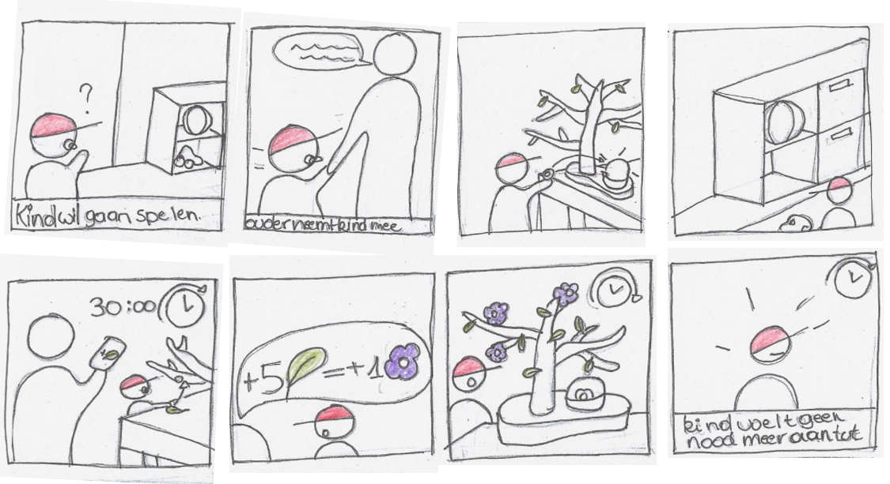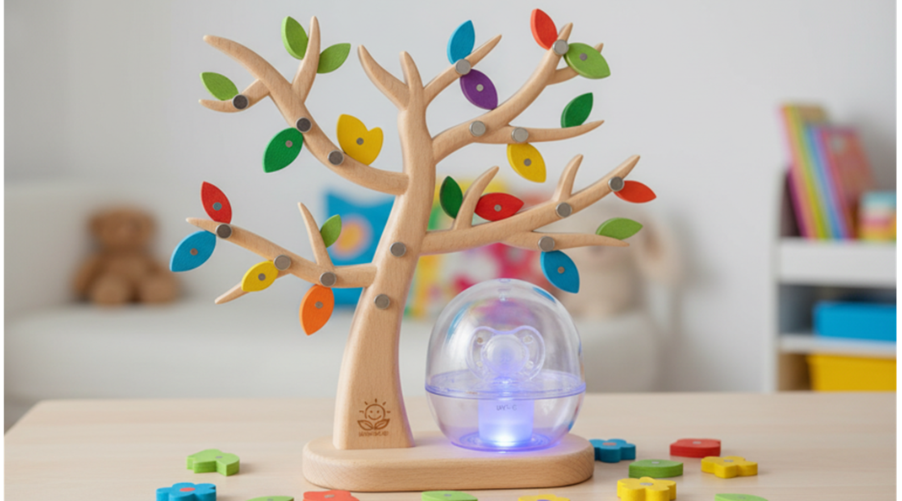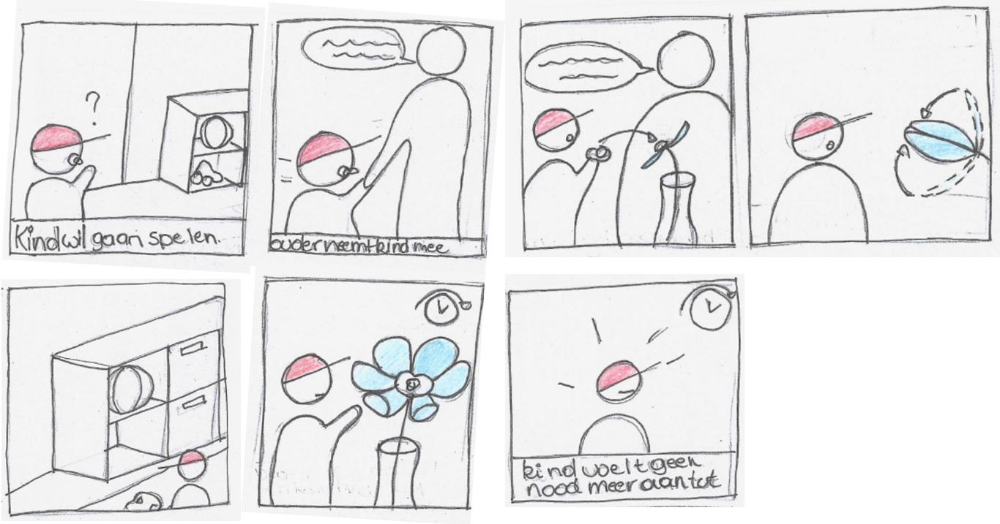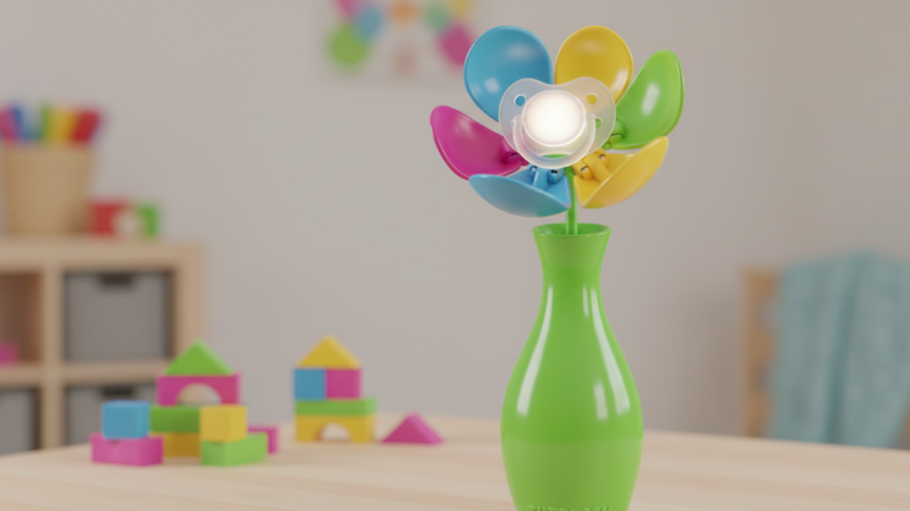
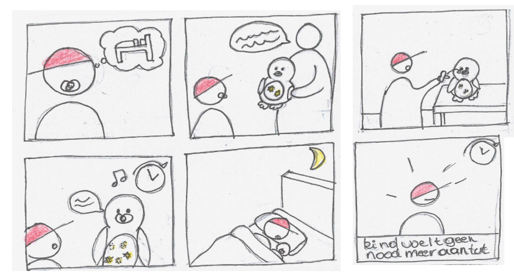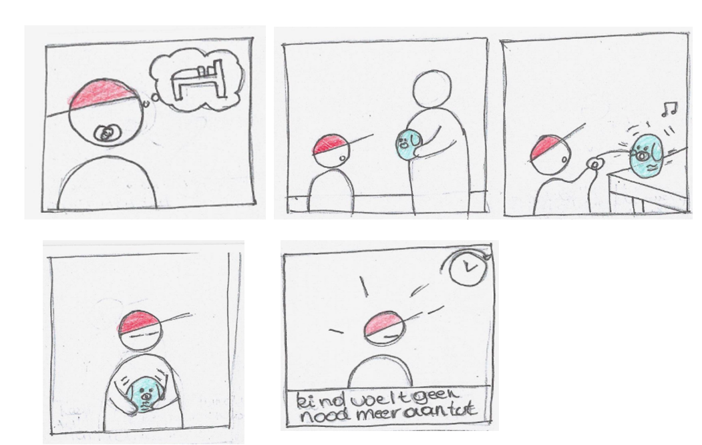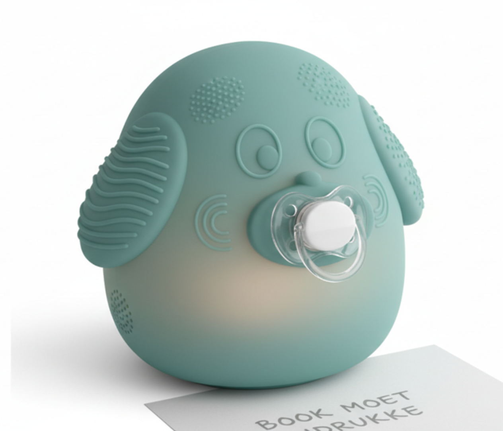
 
 
In de tweede WAVE werden er opnieuw gebruikerinterviews uitgevoerd (N=3). Hiervoor werden van twee concepten een prototype gemaakt. Deze zijn voorgesteld aan de gebruikers waarna er vragen zijn geseld over de deelaspecten van de consepten (onderzoeksraag 1). Verder werden er vragen geseld over hoe zij het gebruiksproces zagen(onderzoeksvraag 2) en of de tut zichtbaar moest zijn(onderzoeksvraag 3). 
Deze interviews namen een tijdsbestek in van ongeveer 40 min. 

De twee consepten werden bedacht uit de bruikbare deelaspekten van wave 1. Deze werden tijdens de interviews besproken en vergeleken om te onderzoeken welke elementen van de concepten het meest geschikt zijn voor jonge kinderen. Er werd variaty prototyping toegepast om zo geen confirmation bias van de geïnterviewden te hebben en zo het gesprek over de verschillende aspecten van het ontwerp te starten.

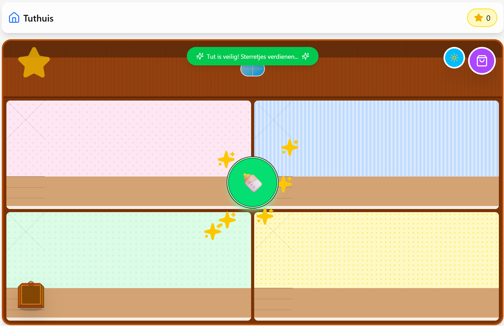
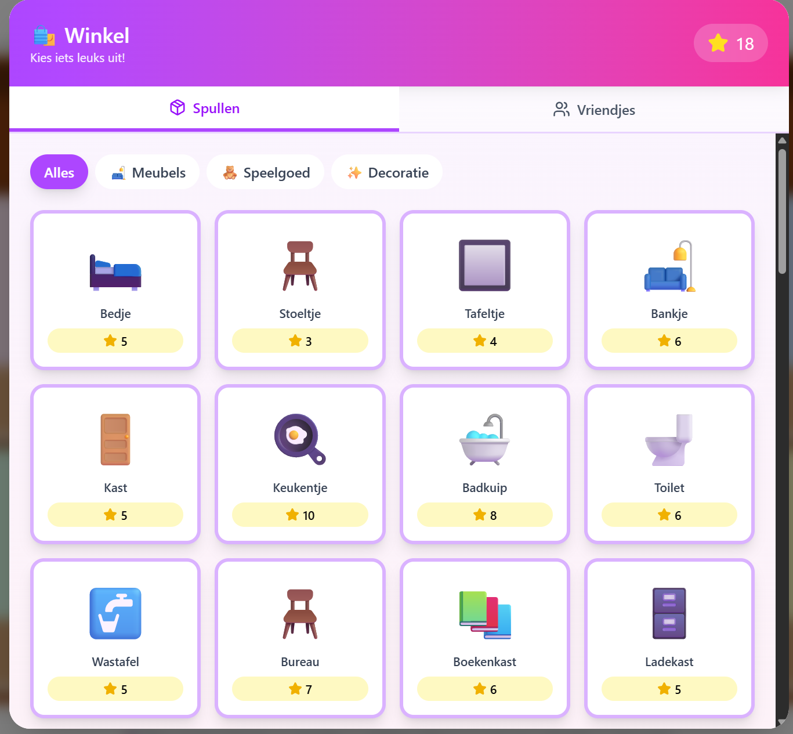
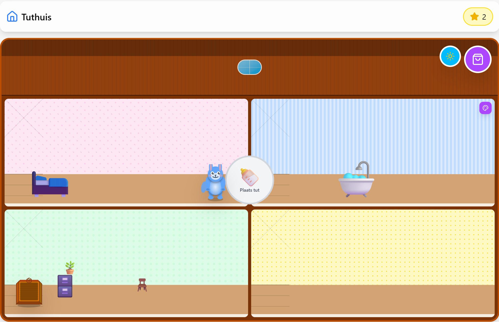
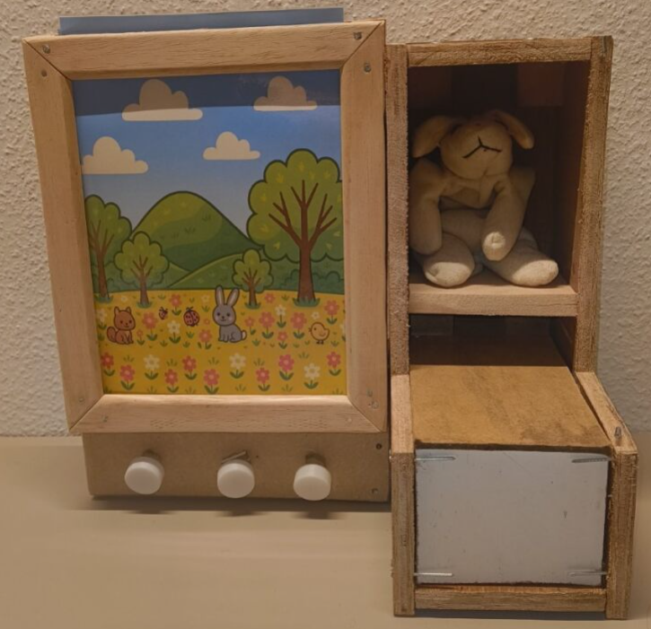
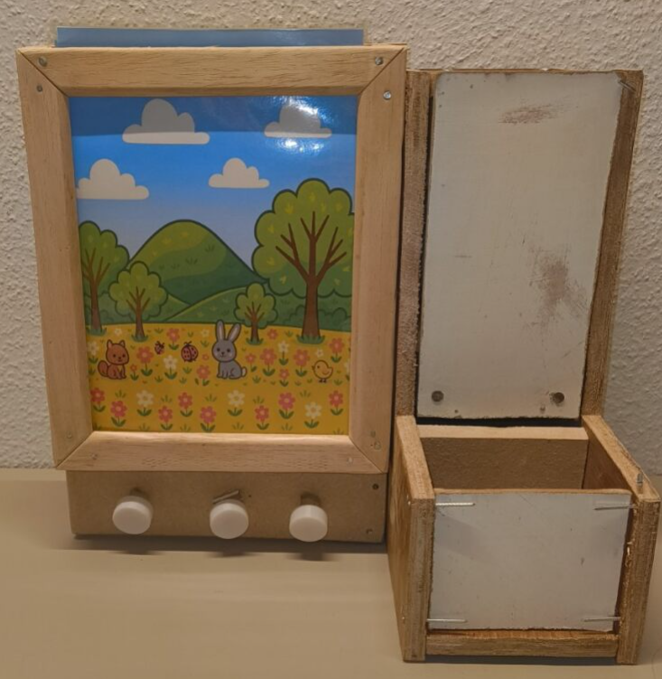

Hoe onderzocht je dit? Wees volledig.  
Leg uit en toon welke prototypes gemaakt werden en hoe deze helpen om de onderzoeksvragen te beantwoorden (benoemen wat je aftoetst & link naar design requirements).   
Leg uit welke testen werden uitgevoerd.
### Resultaten
De resulaten van WAVE 1:
De tut dient voornamelijk als troostmiddel waaraan de kinderen gehecht zijn en wordt gebruikt wanneer de kinderen emotioneel of moe zijn.

Naast de tut hebben de kinderen vaak een knuffel of doekje bij zich.
Het is belangrijk dat het tutgebruik doorheen de dag afgeleerd wordt, aangezien ‘s nachts de tut toch uit het mondje valt en verloren gaat in bed en het kind veelal de nood ervaart tijdens emotionele momenten. 
Visuele vooruitgang is belangrijk bij kinderen. 
Tijd moet aangegeven worden in visuele vorm aangezien kinderen geen tijdsbesef hebben. 
Het is belangrijk dat de tut vastgezet wordt in de tool, zodat de kinderen leren door emotionele momenten te gaan zonder tut. De tijd zonder tut moet daarbij gradueel toenemen. 
Een vorm van directe feedback zoals een geluidje is waardevol alsook beloningen; de kinderen zijn dan gemotiveerd om hun tut af te staan. 
Daarnaast is het aangewezen dat de tool gemakkelijk verplaatsbaar en mee te nemen is.
Ook al wordt een tut niet vaak meer in de klas gebruikt,  staan de kinderonderstueners wel open tot gebruik van de tool.

De resultaten van WAVE 2:
De visuele aspecten van het tweede concept zijn zeer sterk. Dit in combinatie met de interactieve aspecten maakt dat de respondenten de voorkeur geven aan dit concept. De vervanging voor de troostfactor van de tut is moeilijk om te voorzien omdat dit heel hard verschild tussen verschillende kinderen. 

De tool zal hoofdzakelijk op een plaats staan in het huis, maar het zou wel mogelijk moeten zijn om de tool mee te nemen op vakantie en eventueel ook op een familiefeest. Het kan best spelenderwijze visueel geïntroduceerd worden zodat het kind er aan kan wennen voordat de tut afgegeven wordt. Het afleerproces duurt ideaal een aantal weken maar dat zal variëren van kind tot kind. Op het einde van het afleerproces kan er best een officieel moment zijn waarbij de tut definitief wordt afgegeven. Dit kan dan samen gaan met een cadeau of diploma. 

Er is een meningsverschil tussen verschillende ouders of de tut zichtbaar moet zijn voor het kind of juist niet.

De tijd instellen gebeurd best door de ouders die een voorgesteld schema aanpassen zodanig dat ze het kunnen afstemmen op hun kind en de situatie. Het instellen is het best mogelijk zowel op de tool zelf als op een applicatie op de gsm. 

Rapporteer over de resultaten (incl. foto's, quotes, analyseframeworks, ...)
### Conclusies & implicaties
WAVE 1 wordt het volgende geconcludeerd:
Uit de gesprekken blijkt dat de tut voornamelijk fungeert als troostmiddel waaraan kinderen emotioneel gehecht zijn. Het afleren gebeurt het best overdag, wanneer de nood het grootst is door emotionele momenten. 
Visuele ondersteuning, zoals een aftellende timer is noodzakelijk wegens gebrek aan tijdsbesef bij jonge kinderen. 
Een visuele graduele opbouw van tijd, directe feedback in de vorm van een geluidje en de belofte van beloningen vergroten de motivatie. 
Ook moet de tut tijdelijk vastgezet kunnen worden om kinderen te helpen leren omgaan met emoties zonder afhankelijkheid van de tut. 
Tot slot kunnen auditieve hulpmiddelen zoals rustgevende muziek bijdragen aan een kalmerend effect.

WAVE 2 word als volgt geconcludeerd:
De tool zal hoofdzakelijk visuele feedback moeten geven gecombineerd met beloning en een interactief aspect om de aandacht van de kinderen erbij te houden. Dit kan ook nog gecombineerd worden met andere vormen van feedback. Verder zal de tool best de grote van een tablet hebben zodat het scherm groot genoeg is en eenvoudig te transporteren. De tijd moet zowel op de tool als op de gsm ingesteld kunnen worden door de ouders en eventuele oppas. De tool zal op een plaats in huis gebruikt worden over een periode van een aantal weken al hangt dit af van het kind.
Kinderen hebben snel door hoe iets werkt, dus een kinderslot is van belang.
De leeftijd waar de kinderen de tut afleren heeft een rol in hoe goed het kind de tool zal begrijpen.
Er is verder onderzoek nodig naar de zichtbaarheid van de tut in de tool. 

Definieer de belangrijkste designbeslissingen.
