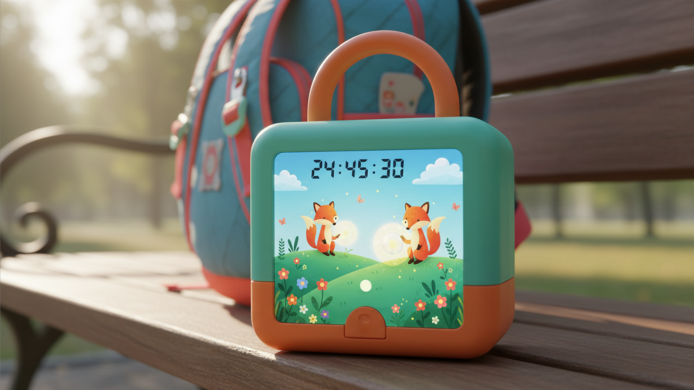

## Definition
De definition-fase bestaat uit drie onderzoek waves. Deze werden uitgevoerd tussen 01/11/2025 en 15/01/2026.

### WAVE1
#### Doestellingen
Het doel van deze WAVE was een duidelijker beeld te krijgen in welke vorm ouders de tool het meest bevorderlijk vonden. Daarnaast moest er een dieper inzicht verkregen worden in het tutgebruik en de bereidheid van scholen en opvang om ondersteuning te bieden.
De hoofdonderzoeksvragen zijn:
-	In welke dagelijkse situaties gebruikt het kind de tut?
-	Aan welke voorwerpen is het kind gehecht?
-	In welke mate staan kindervoorzieningen open om deel te nemen aan het afleerproces van de tut?
-	Welke vorm van ondersteuning is het meest effectief voor het kind? 
-	Wat helpt het kind het meest in het afleerproces: een tool positief bekrachtigt of actief stimuleert?

#### Materiaal & methoden
De eerste WAVE bestond uit gebruikersinterviews met 3 ouders en 2 kinderbegeleiders,  gericht op conceptuele aspecten (vraag 4) en tutgebruik, stimulatie en hechting (vragen 1–3). (Duur: 40 minuten)

Vijf concepten werden vergeleken via storyboards en realistische Vizcom-visualisaties van eerder gemaakte schetsen, dit was het efficiënste aangezien de meeste interviews online doorgingen. Hierbij werd variety prototyping ingezet om de confirmation bias te vermijden. Alle tools voldeden aan de design requirements opgesteld uit de discovery. De geteste elementen waren: verplaatsbaarheid van tut, autonomie van kinderen, invloed van beloningen, vormen van feedback en motiverende elementen.

Concept 1:

Concept 2:

Concept 3:

Concept 4:

Concept 5:

 
 In Onderstaand protocol zijn de onderzoeksvragen terug te vinden en hoe dit proces plaatsvond. 
 - Ouders:
[interview protocol ouders](<../reports and protocols/Interview - protocol - ouders -wave1.pdf>)
 - Kinderbegeleiders:
[interview protocol kinderbegeleiders](<../reports and protocols/Interview protocol_wave1_kinderbegeleiders.pdf>)

#### Resultaten

De tut dient vooral als troost bij emotionele momenten. Naast de tut hebben kinderen vaak  een knuffel. Overdag is het belangrijk het tutgebruik geleidelijk af te leren, zodat kinderen ’s nachts ook zonder tut kunnen.

Omdat kinderen geen tijdsbesef hebben is zichtbare vooruitgang essentieel. 
De tut moet tijdelijk vastgezet worden in een tool, zodat kinderen leren emoties te verwerken zonder tut. 

De tutloze tijd wordt stapsgewijs verlengd, ondersteund door directe feedback en beloningen om de motivatie te verhogen. De tool moet bovendien makkelijk verplaatsbaar zijn.

Hoewel de tut in de klas weinig wordt gebruikt, staan kinderondersteuners open voor het gebruik van zo’n tool.

Het uitgebreidere verslag is hieronder terug te vinden:
[interview rapport WAVE 1](<../reports and protocols/Interview_rapport_Wave 1.pdf>)

#### Conclusies & implicaties

Uit de gesprekken blijkt dat de tut voornamelijk een emotioneel troostmiddel is. Afleren gebeurt het best overdag, hier is de nood het grootst door emotionele elementen. Omdat jonge kinderen geen tijdsbesef hebben, is visuele ondersteuning essentieel.

Een visuele opbouw van tijd, directe feedback en beloningen vergroten de motivatie. De tut moet tijdelijk vastgezet kunnen worden zodat kinderen omgaan met emoties zonder afhankelijkheid. 
Tot slot kunnen auditieve hulpmiddelen bijdragen aan een kalmerend effect.

## WAVE 2
#### Doestellingen
Het doel is te achterhalen welke conceptualisatie het beste is. Dit door de implicaties van de eerste wave toe te passen op 2 nieuwe concepten, om opnieuw aan variety protoyping te doen. Hierbij kan achterhaald worden welke aspecten belangrijk zijn en missen.
De hoofdonderzoeksvragen zijn :
-	Wat zijn de goede/slechte aspecten ?
-	Hoe zal het gebruiksproces eruitzien?
-	Is de zichtbaarheid van de tut belangrijk?

#### Materiaal & methoden
 
Er werden gebruikersinterviews afgenomen (N=3), waarbij twee prototypes werden getest. De concepten werden besproken met vragen over deelaspecten (onderzoeksvraag 1), het gebruiksproces (onderzoeksvraag 2) en de zichtbaarheid van de tut (onderzoeksvraag 3). (Duur: 40 minuten)

Met inzichten uit WAVE 1 werden twee concepten ontwikkeld. Deze werden tijdens interviews vergeleken om te bepalen welke elementen het meest geschikt zijn. Door variaty prototyping toe te passen, werd confirmation bias vermeden en werd het gesprek over de verschillende ontwerpaspecten gestimuleerd.

Concept 1:

Concept 2:

In Onderstaand protocol zijn de onderzoeksvragen terug te vinden en hoe dit proces plaatsvond. 
[Inerview protocol WAVE 2](<../reports and protocols/Interview - protocol - ouders -wave2.pdf>)

#### Resultaten
De visuele en interactieve aspecten van het tweede concept worden als zeer sterk ervaren, waardoor dit concept de voorkeur krijgt. Het vervangen van de troostfunctie van de tut blijft echter moeilijk, omdat dit verschilt per kind.

De tool krijgt een vaste plaats in huis, maar moet ook verplaatsbaar zijn. Een visuele introductie helpt het kind de tool te begrijpen. 
Het afleerproces duurt idealiter enkele weken en wordt afgesloten door het definitief afgeven van de tut in combinatie met het krijgen van een cadeau.

Over de zichtbaarheid van de tut bestaan uiteenlopende meningen. 
De tijdsinstelling gebeurt door de ouders, op basis van een voorgesteld tijdsverloop; dit moet mogelijk zijn zowel via de tool (dit met kinderslot om manipulatie door het kind te voorkomen) zelf als via een applicatie.

Het uitgebreidere verslag is hieronder terug te vinden:
[interview rapport WAVE 2](<../reports and protocols/Interview_rapport_Wave 2.pdf>)

#### Conclusies & implicaties

De tool zal hoofdzakelijk  feedback moeten geven en een interactief aspect om de aandacht van de kinderen erbij te houden. Het scherm zou best de grootte van een tablet hebben zodat het groot genoeg is om aangenaam de interface te kunnen zien maar tegelijk eenvoudig om te transporteren. 
De tijd moet zowel op de tool als op de gsm ingesteld kunnen worden en niet manipuleerbaar zijn door kinderen. 
De tool zal op een vaste plaats in huis gebruikt worden over een periode van enkele weken.
Het belang van de zichtbaarheid van de tut moet verder onderzocht worden.

Volgende implicaties werden gevonden:
-	Kinderslot op de tijdsinstelling 
-	Visuele feedback in combinatie met beloning
-	Schermgrootte van een tablet 
-	Tijd instelbaar zowel op de tool als op gsm 
-	Standaard plan voor tijd
-	Verplaatsbare en meeneembare tool
-	Verder onderzoek nodig naar de zichtbaarheid van de tut

## WAVE 3
#### Doestellingen

Het doel van de derde wave is een beeld te krijgen over de pedagogische aspecten van de tool. De experten geven pedagogische inzichten die de ouders ons niet kunnen bieden. Ze vertellen ons meer over het de interface best opgebouwd kan worden.
De hoofdonderzoeksvragen zijn als volgt:
-	Wat zijn de goede/slechte aspecten?
-	In hoeverre ondersteunen de voorgestelde concepten kinderen bij het afbouwen?
-	Welke ontwerpkeuzes hebben de grootste invloed op motivatie/betrokkenheid van kinderen?
-	Hoe moet de interface en omgeving worden vormgegeven om aan te sluiten bij de ontwikkelingsfase van 2–5 jarigen?
-	Wat is de rol van beloning en feedback in het leer- en afbouwproces van de tut, en wanneer zijn deze het meest effectief?
-	Is de zichtbaarheid van de tut belangrijk?

#### Materiaal & methoden

In deze wave werden de prototypes van wave 2 opnieuw gebruikt. Deze werden voorgesteld en bevraagd. Hierbij lag de focus op het tweede protoype omdat de gebruikers daar de voorkeur aan gaven. Verder werd er bevraagd naar de motivatie van het kind, interface, beloning en feedback en zichtbaarheid van de tut.
De interviews vonden plaats met twee kinderpedagogen. (Duur: 30 minuten)

In Onderstaand protocol zijn de onderzoeksvragen terug te vinden en hoe dit proces plaatsvond. 
[Interview protocol WAVE 3](<../reports and protocols/Interview - protocol - expert-wave3.pdf>)

#### Resultaten

Uit de expertinterviews blijkt dat het tweede concept als het meest realistisch en motiverend wordt ervaren, vooral wegens de visuele groei over tijd.

Beloningen zijn essentieel bij het terugnemen van de tut en moeten gekoppeld zijn aan de duur dat de tut werd weggelegd. Beperkte keuzevrijheid en tussentijdse beloningen versterken autonomie en voorkomen frustratie.

Feedback dient multisensorisch te zijn, met bijzondere aandacht voor het moment waarop de tut in de tool wordt geplaatst. Een eenvoudige, kleurrijke en herkenbare interface sluit het best aan bij jonge kinderen, terwijl complexiteit averechts werkt.

Jongere kinderen (±2–3 jaar) hebben moeite met objectpermanentie wanneer de tut niet zichtbaar is.

Het uitgebreidere verslag is hieronder terug te vinden:
[Interview rapport WAVE 3](<../reports and protocols/Interview_rapport_Wave 3_expert interviews.pdf>)

#### Conclusies & implicaties
De expertinterviews tonen aan dat een succesvolle tool voor het afleren van de tut moet inzetten op groei, eenvoudige visuele feedback en een duidelijke beloningsstructuur. Beloning en feedback zijn belangrijk voor blijvende motivatie. Een simpele, kleurrijke interface met herkenbare elementen en beperkte keuzes werkt het best bij kinderen van de vooropgestelde leeftijdscategorie. 

Volgende implicaties werden bekomen:
-	Het concept moet focussen op progressie over tijd, visueel zichtbaar gemaakt voor het kind.
-	Beloningssystemen gradueel moet blijven.
-	De interface simpel, kleurrijk en herkenbaar voor het kind, met aanpasbare zichtbaarheid van de tut.
-	Ouders actief betrokken worden bij feedback en beloning.
-	De interface in de leefwereld van de kinderen blijft.
