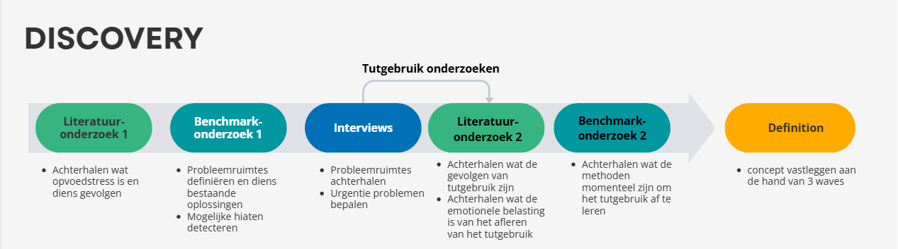

## Discovery
<!-- Max. 1000 woorden.   
[!] Algmeen: Maak voldoende gebruik van schematische/grafische weergaves en tabellen. -->

De algemene challenge is een slimme tool te ontwikkelen die de opvoedstress bij ouders verlicht. Hiervoor moet in eerste instantie het fenomeen van opvoedstress bestudeerd en de probleemruimtes die hierbij komen bepaald worden. Dit was het eerste deel van de discovery-fase. Op het einde van deze fase wordt dan een probleemruimte geselecteerd waarvan de ouders aangaven aanzienlijke stress te ervaren en waarrond een product kan  ontworpen worden die de stress bij ouders zal verlichten. Deze fase verliep in dit project zoals in onderstaande illustratie:

Als start werd een literatuuronderzoek verricht, dit om inzicht te verkrijgen in wat opvoedstress precies inhoudt en welke effecten dit heeft op het gezinsleven. Hiervoor werden 10 bronnen geraadpleegd. Dit onderzoek had als onderzoeksvragen:
- Wat houdt opvoedstress in?
- Welke effecten heeft opvoedstress op het gezinsleven?
- Welke kleine dagelijkse factoren dragen bij aan de opvoedstress van jonge ouders, en op welke manieren kunnen deze factoren worden verlicht?
Onderstaand is het protocol terug te vinden, waarin wordt beschreven hoe dit proces plaatsvond. 
Protocol: https://drive.google.com/file/d/15U9IWZ--omdJ6xzIkhTUAmE-31aCuCi5/view?usp=drive_link 

Uit dit literatuuronderzoek kwamen de volgende bevindingen:
Opvoedstress is het fenomeen waarbij ouders het gevoel hebben dat de eisen van opvoeding de middelen en vaardigheden die ze kunnen bieden overstijgen. Het vermindert de opvoedkwaliteit, ouderlijke warmte en kan probleemgedrag bij kinderen versterken/veroorzaken. Dit komt door een cumulatie aan stressfactoren, zijnde stress op het werk, stressfactoren thuis en druk uit de maatschappij. Structuur, voorspelbare routines en steun verlichten stress en bevorderen positief het gezinsfunctioneren.
Het rapport van dit onderzoek is terug te vinden aan de hand van volgende link:
rapport: https://drive.google.com/file/d/1YNpuBwwfPAsfsY4IAO3G3PJZb65Y0v1m/view?usp=drive_link

Uit dit literatuuronderzoek werden echter nog geen specifieke stressfactoren geïdentificeerd. Daarom werd er ook een benchmarkonderzoek (N=14) verricht om te achterhalen wat stressfactoren bij ouders zijn en hoe deze momenteel opgelost worden, om zo ook mogelijke hiaten te detecteren. 
Dit onderzoek had volgende onderzoeksvraag:
- Welke bestaande slimme oplossingen zijn op de markt om opvoedstress te verlichten?
Protocol: https://drive.google.com/file/d/1XnSyVBmMh3gjSOEp_HzEzGY6mTpbD50O/view?usp=drive_link 

Hieruit kwamen volgende stressfactoren en conclusies:
De benchmarking laat zien dat bestaande slimme producten vooral inspelen op:
1. Slaap- en bedtijdrituelen
2. Dagelijkse planning en routines
3. Emotionele regulatie van kinderen (driftbuien, frustratie)
4. Tutgebruik
5. Zindelijkheid
6. Ouderondersteuning bij spel en ontspanning
De producten bieden effectieve ondersteuning bij deze activiteiten, waardoor opvoedstress wordt verlaagd. Dit sluit aan bij de bevindingen uit het literatuuronderzoek: dagelijkse stressfactoren dragen bij aan de ouderstress en kunnen door structuur en hulpmiddelen aanzienlijk worden verminderd. Hieruit blijkt dat voor al de bovengenoemde stressfactoren reeds redelijk wat producten op de markt zijn.

In deze link is een uitgebreider verslag terug te vinden:
https://drive.google.com/file/d/119J4bg0LSY7QWqJH_zCYeypWofi05ohk/view?usp=drive_link

Om de stressfactoren verder te achterhalen en te ontdekken wat ouders (dagelijks) ervaren werden 5 ouders geïnterviewd. Deze fase had volgende onderzoeksvragen:
- Welke kleine dagelijkse factoren dragen bij aan de opvoedstress van jonge ouders en
op welke manieren kunnen deze factoren worden verlicht?
▪ Hoe ervaren ouders de opeenstapeling van kleine stressmomenten?
▪ In welke situaties voelen ouders zich het meest belast?
▪ Welke kleine, terugkerende gebeurtenissen dragen bij aan deze stress?
▪ Welk effect hebben bestaande producten op hun stressniveau?

Protocol: https://drive.google.com/file/d/1ADO25fnMRPdoYmWG6HtR9QI1mex7xOla/view?usp=drive_link 

Deze interviews gavens de volgende inzichten:
• Dagelijkse stress ontstaat door cumulatie van factoren (eten, opruimen, slapen, routines) bij ouders.
• Afleren van tutgebruik is een emotioneel beladen gebeurtenis.
• Visuele hulpmiddelen zoals planners en schema’s zijn nuttig, vooral bij jongere kinderen.
Opruimen, eten en stoppen van tutgebruik blijken grote stressfactoren voor de ouders te zijn die aangepakt dienen te worden.
Hoewel het stoppen van tutgebruik een korte periode is, is dit wel een emotionele constante gedurende die ouder en kind zwaar belast. Dit beschrijven de ouders als een onverwacht bijkomende belasting van hun ouderlijke taken.
Het uitgebreidere verslag is hieronder terug te vinden:
https://drive.google.com/file/d/1cDNH9Jo70q3FyCBBtWTjgxl0r6BWUpSW/view?usp=drive_link 

De probleemruimtes die werden gedefiniëerd in deze 3 onderzoeken werden uitgezet in een problem-solution matrix:

Alle geïnterviewde ouders gaven aan dat het afleren van het tutgebruik een zeer emotionele ervaring is. Daarom werd hier ook een literatuuronderzoek (N=12) op verricht, met volgende onderzoeksvragen:
- Welke emotionele waarde heeft een tut voor bij een kind?
- Wanneer wordt een tut gebruikt?
- Wat zijn de effecten van langdurig gebruik van een tut?
- Wat zijn hulpmiddelen om het gebruik van een tut af te leren?
- Wat zijn de effecten bij een kind wanneer de tut weg moet?

Hieruit bleek dat langdurig tutgebruik veel negatieve (medische) gevolgen heeft, naast de zeer emotionele ervaring waarbij de tut van de ene op de andere dag verdwijnt bv. de tut wordt meegegeven aan Sinterklaas. Voor het tutgebruik bestaat er nog geen product die het afbouwen van het tutgebruik tot een positieve ervaring maakt. De schaarse producten die bestaan, lijken niet de voldoen aan de verwachtingen van de ouders. Om dit hiaat te vullen, werd er besloten om dit probleem aan te pakken om zo, de hoewel korte stressvolle periode, het afscheid nemen van de tut bij ouders en kinderen te verlichtten. Hierrond werd onderstaande innovatrix uitgewerkt:

Designbeslissingen:

Uit de bovenstaande onderzoeken werd besloten om een interactieve tool te maken die het kind aan de hand van positieve feedback begeleidt in het afbouwen van het tutgebruik.

<!-- ### Doestellingen
Wat wilde je bereiken? 
Welke deelvragen moesten hiervoor beantwoord worden?

### Materiaal & methoden
Hoe onderzocht je dit? Wees volledig.    
Leg uit welke onderzoeksmethoden werden uitgevoerd en hoe dit werd aangepakt (link door naar het protocol).
### Resultaten
Rapporteer over de resultaten (incl. foto's, quotes, analyseframeworks, ...)
### Conclusies & implicaties
Definieer de belangrijkste designbeslissingen -->
